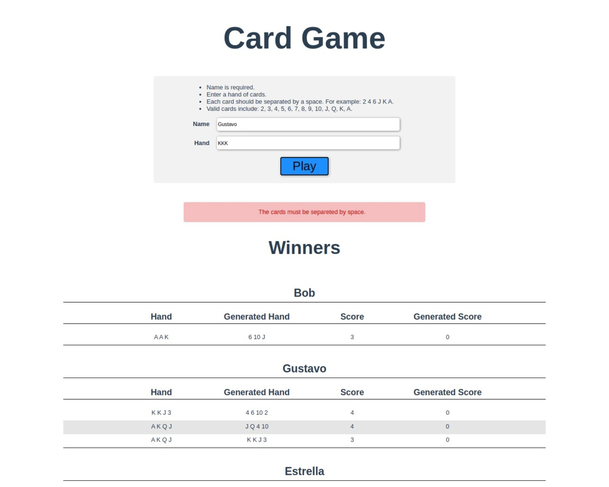

# Card Game App

## About
This is a simple APP test to ACTO. It's a frontend web app. Must be used with [card-game-api](https://github.com/GustavoMagalhaess/card-game-api)


### Build
```
docker build -t card-game-web .
```

### Run
```
docker run -it -p 8080:8080 --rm --name card-game-web card-game-web
```

## How it works

This app is using Vue Framework. It's a very simple app. There is no auth or CSRF 
protection. There is no layout framework due some incompatibility with Vue 3. So I made it using a simple CSS sytle.

The app is separated in 3 components:

- A parent ```GameComponent``` with the form. It will check form fields by default. If it is foreced the backend will take care of it.

- A child ```WinnersListComponent``` that's only take care of the list of winners.

- A child ```MessagesComponent``` tha's only thake care of the Success message and Errors messages.

## Screens

### 1. Form game an list


### 2. Errors messages




### 3. Success message

